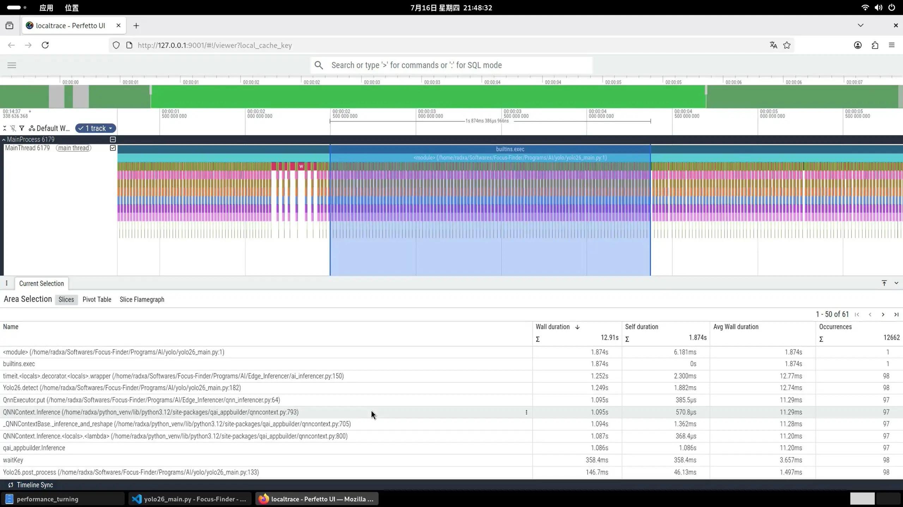

# Performance

## ⚡ 性能测试

⚠️ 性能测试数据数据为**参考值**，实际性能取决于具体硬件型号、驱动版本、量化精度及输入分辨率。 

> - 测试前均设置 CPU 频率为用户**最高**可设置频率
> - 测试前均绑定本程序所有的进程/线程（含子进程/线程）的 CPU 亲和度为**性能核心**
> - 推理时间为模型**在 NPU 的**推理时间
> - 后处理时间为将推理结果处理为**可用数据**（如 bbox、class、score 等）的时间
> - 推理时间和后处理时间**不包括**预处理时间，如缩放图像、bgr 转 rgb、nwc 转 nhwc、归一化等，**也不包括**拷贝数据时间
> - 并发推理时间**包含**推理时间、后处理时间以及拷贝数据时间，但**不包括**预处理时间
> - 高通平台推理相关数据**存疑**，部分原因可参考下文

### 💡 **如何获取实际数据：** 
> 1. ai_inferencer 模块提供了 `timeit` 装饰器，可用于测量任意函数的耗时
> 2. 使用 `VizTracer` 工具 Tracer 要运行的文件，之后浏览统计并统计结果

### 测试项目：
#### 1. NPU 推理时间 
测试目标：NPU 的 Python API 中，**作为 `推理` 函数**的运行时间。 

测试方法：使用 `VizTracer` 工具Tracer**推理脚本**。同时推理脚本内使用 NPU 的 Python API 中的 **`单任务` 推理模式**。 

数据读取方式：使用 `VizViewer` 读取 `VizTracer` 工具生成的文件，并划出**1秒多**的时间段，使用火焰图统计 `NPU` 的 `推理` 函数的**平均**运行时间。 

> 参考下图左下角"QNNContext.Inference: 11.29ms"

#### 2. 后处理时间
测试目标：**推理脚本**中，将推理结果处理为**可用数据**（如 bbox、class、score 等）的函数。

测试方法：使用 `VizTracer` 工具Tracer**推理脚本**。

数据读取方式：使用 `VizViewer` 读取 `VizTracer` 工具生成的文件，并划出**1秒多**的时间段，使用火焰图统计 `后处理` 函数的**平均**运行时间。 

> 参考下图左下角"Yolo26.post_process: 1.49ms"

#### 3. 并发推理时间
测试目标：使用 Python 将 NPU 的 Python API 中，**作为 `推理` 的函数**，进行组合而成的的并发（多线程/进程）推理器，在推理时每两帧的取出时间。 

测试方法：使用 ai_inferencer 模块提供了 `timeit` 装饰器。`measure_cycle_time`参数为False。 

数据读取方式：瞪眼查看终端中`timeit`装饰器输出的数据，喜欢哪个就选哪个。 

---

## ⚠️ 高通 QAI AppBuilder 并发推理的局限性

QNN 并发推理面临一系列由 `QNNContext`、`QNNContextProc` 内部复杂性引发的固有限制：

**根本原因：** 部分 soc(如QCS6490) 的 HTP（DSP）通常不具备多个独立逻辑核心，其"并发"本质上是通过提高运算器（如矩阵乘法累加器）利用率与内存带宽利用率来实现的，而非真正的多核并行。

**Python 端的限制：**
- `QNNContext` 内部状态复杂，**不支持多线程并发访问**，必须加锁保护
- 由于 Python GIL 与 QNN 锁的叠加，线程池在 QNN 场景下负收益
- 因此只能退而求其次，在 **Python 端使用多进程（`multiprocessing`）** 来手动并发
- qai appBuilder 用于并发推理的 `QNNContextProc` 存在bug, 创建和释放时可能会触发。 
同时基于`QNNContextProc`的并发推理速度比本小姐写的`QnnProcessPool` **Python multiprocessing based 多进程QNN推理器** 快不了几个ms（不过内存占用少了些）

**隐藏的稳定性风险：**

| 风险 | 表现 | 推测原因 |
|------|------|------|
| **QNNContext 创建失败** | 进程池初始化时无法创建上下文 | 不知道 ~~高通工程师更更爆~~ |
| **cDSP 内存申请失败** | 推理中途报错、进程异常退出 | 不知道 ~~高通工程师更更爆~~ |
| **与其他库冲突** | 与opencv库等同时使用时崩溃或卡死 | 多进程争抢同一内存资源（DSP、CMA 内存池） >~~高通工程师更更爆~~ |
| **轮询开销** | 实际大部分时间耗在轮询多个推理任务而非真实并行计算 | HTP 的核心调度策略是时分复用而非空间并行 |

**其他问题：** 小女子手上的 `Radxa Dragon Q6A` (QCS6490)的 `dsp(HTP)` 可能并**非较为完整的神经网络加速器**，部分计算需要**在CPU端完成**，不仅并发性能受限，还**影响其他CPU任务** 
(例：在并发时，由于偷用大量CPU资源导致预处理和后处理时间明显拉长，从而拖慢整组并发推理任务)

> **建议：** 若追求并发稳定性，优先使用`QnnProcessPool` **Python multiprocessing based 多进程QNN推理器**，由叶姐姐🍃亲手维护。 
>
> 叶姐姐🍃: 不是哥们，你这大高通的soc高出来的性能就被这些奇妙开销给磨掉了，rk恩情还不完✋😭🤚